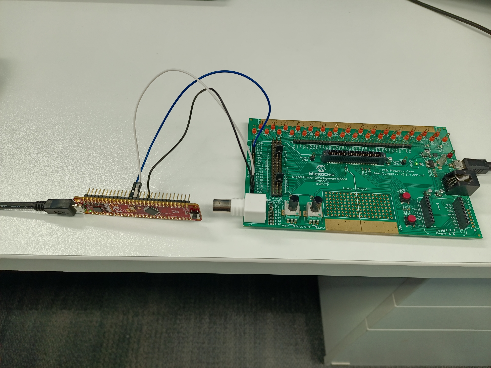
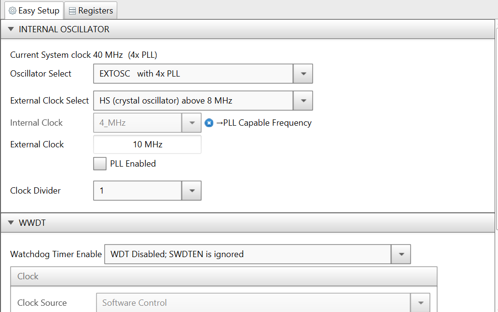
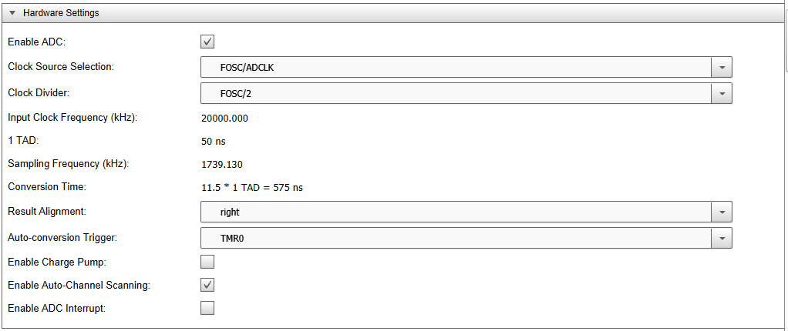

# pic18f57q84-adc-channel-sequence

In this project the Analog-to-Digital Converter with Computation and Context Module (ADCCC) of the PIC18F57Q84 is used to read two channel (ANA0 & ANA1) by 4 channel sequencer. 

## Software Used
- MPLAB® X IDE 5.45 or newer [(microchip.com/mplab/mplab-x-ide)](http://www.microchip.com/mplab/mplab-x-ide)
- MPLAB® XC8 2.32 or newer compiler [(microchip.com/mplab/compilers)](http://www.microchip.com/mplab/compilers)
- MPLAB® Code Configurator (MCC) 4.10 or newer [(microchip.com/mplab/mplab-code-configurator)](https://www.microchip.com/mplab/mplab-code-configurator)
- MPLAB® Code Configurator (MCC) Device Libraries PIC10/PIC12/PIC16/PIC18 library v1.81.7 or newer [(microchip.com/mplab/mplab-code-configurator)](https://www.microchip.com/mplab/mplab-code-configurator)
- Microchip PIC18F-Q Series Device Support (1.1.185) or newer [(packs.download.microchip.com/)](https://packs.download.microchip.com/)

## Hardware Used
- PIC18F57Q84 Curiosity Nano [(DM182029)](https://www.microchip.com/Developmenttools/ProductDetails/DM182029)
- Digital Power Development Board [(DM330029)](https://www.microchip.com/DevelopmentTools/ProductDetails/PartNO/DM330029)

## Setup

In this demo,

- PIC18F57Q84 MCU is used to read an voltage on ANA0 & ANA1.

 

### MCC Settings

This section shows the settings used in the demo/example for various MCU modules configuration. These settings were done using the Microchip Code Configurator (MCC). Open MCC to look at the settings of the modules.

### System Module Settings

The MCU uses the high frequency external oscillator (10MHz), and the clock is set to 4*PLL (40 MHz).

 

### ADCC Settings

The ADCC is configured with a clock of FOSC/2.

 
 
 
 
 

### NCO Settings

The NCO is configured in FDC mode, with FOSC set as clock source, and an initial output frequency of 1 kHz.

 

### Pin Manager Settings

The pins are configured as follows:

- Pin RC2 is set as analog input (ANC2) for reading the UV Click
- Pin RC0 is set as analog input (ANC0) for reading the POT1
- Pin RC1 is set to be the output of NCO1

 

## Demo
1. After making the above hardware connections, build demo firmware and load the generated hex file onto the PIC16F18446 MCU.
2. When the demo firmware is loaded, listen to the headphones and you will hear a tone
3. Vary the POT1 to adjust the offset
4. Vary the UV light intensity on the sensor and notice the changing frequency of the tone.

## Conclusion

This example shows how easy it is to use the PIC16F18446 and MCC to read an analog UV light intensity sensor and generate a variable frequency tone using the NCO.
